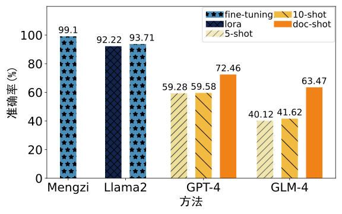
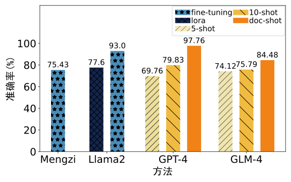

# LLSec

LLSec is a prototype tool for generating business rule specifications in the securities domain based on large language models. It is the official implementation for paper [](). In this paper, we propose an automatic specification method for business rules in the securities domain based on large language models, which utilizes the powerful natural language processing ability of the large language models to assist in classification and extraction of software requirement related business rules. In addition, we also use domain knowledge to assist in refining business rules and identifying rule relationships, ultimately forming a requirement specification in the form of a data stream.


## Project Structure

> - **data/**. The annotation, training and validating data for rule filtering and rule extraction.  
>   - **business_rules/**. The annotation data.
>   - **rule_\***. Training and validating data for Llama2 (.csv) and Mengzi (.json).
>   - **knowledge.json**. The domain knowledge base.
> - **experiment**. Data and codes for producing the experimental results.  
> - **fine_tune_llama2_model**. Codes for fine-tuning Llama2 and use the trained model to interface.
> - **lora_train_llama2_model**. Codes for lora training LLama2 and use the trained model to interface.
> - **specification_generation**. Codes for the 4-step framework that generates specifications from rule documents.
> - **train_rule_extraction_model**. Codes for fine-tuning Mengzi for rule extraction task.
> - **train_rule_filtering_model**. Codes for fine-tuning Mengzi for rule filtering task.
> - **transfer**. Codes to transfer the rule format.


## Getting Started

We provide commands that will install all the necessary dependencies step by step (sudo rights might be required). We conducted all the experiments on a workstation equipped with a 32-core AMD Ryzen Threadripper PRO 5975WX CPU, 256GB RAM, and an NVIDIA RTX 3090Ti GPU running Ubuntu 22.04.

1. Install dependencies.

    ```bash
    sudo apt update
    sudo apt upgrade -y
    sudo apt install build-essential zlib1g-dev libbz2-dev libncurses5-dev libgdbm-dev libnss3-dev libssl-dev libreadline-dev libffi-dev
    sudo apt-get install -y libgl1-mesa-dev
    sudo apt-get install libglib2.0-dev
    sudo apt install wget
    sudo apt install git
    ```

2. Install miniconda.

    ```bash
    cd ~
    wget https://repo.anaconda.com/miniconda/Miniconda3-latest-Linux-x86_64.sh
    bash Miniconda3-latest-Linux-x86_64.sh
    source ~/.bashrc
    ```

3. Create a virtual python environment and install all the required dependencies.
    ```bash
    git clone https://github.com/LingelLi/LLSec  
    cd LLSec  
    
    # Use conda to install
    conda create -n LLSec python=3.10  
    conda activate LLSec  
    pip config set global.index-url https://pypi.mirrors.ustc.edu.cn/simple  
    pip install -r requirements.txt  
    
    # Install flash-attention based on your CUDA version. For example:
    wget https://github.com/Dao-AILab/flash-attention/releases/download/v2.5.6/flash_attn-2.5.6+cu122torch2.1cxx11abiFALSE-cp310-cp310-linux_x86_64.whl  
    pip install flash_attn-2.5.6+cu122torch2.1cxx11abiFALSE-cp310-cp310-linux_x86_64.whl  
    
    pip install -e .  
    ```

4. Download the trained LLMs.
    ```bash
    git lfs install
    git clone https://huggingface.co/whotookmycookie/LLSec
    cp -r LLSec/mengzi_rule_filtering/ train_rule_filtering_model/model/
    cp -r LLSec/mengzi_rule_extraction/ train_rule_extraction_model/model/
    cp -r LLSec/llama2_rule_filtering_fine_tune/ fine_tune_llama2_model/model/rule_filtering/
    cp -r LLSec/llama2_rule_extraction_fine_tune/ fine_tune_llama2_model/model/rule_extraction/
    cp -r LLSec/llama2_rule_filtering_lora/ lora_train_llama2_model/model/rule_filtering/
    cp -r LLSec/llama2_rule_extraction_lora/ lora_train_llama2_model/model/rule_extraction/

    git clone https://huggingface.co/FlagAlpha/Atom-7B
    cp -r Atom-7B/ fine_tune_llama2_model/model/
    cp -r Atom-7B/ lora_train_llama2_model/model/

    git clone https://huggingface.co/Langboat/mengzi-bert-base-fin
    cp -r mengzi-bert-base-fin/ train_rule_filtering_model/model/
    cp -r mengzi-bert-base-fin/ train_rule_extraction_model/model/

    rm -rf LLSec
    rm -rf Atom-7B
    rm -rf mengzi-bert-base-fin
    ```


5. Run a test demo.

    ```bash
    cd specification_generation
    python main.py
    ```
    After the command finishes running, the generated specifications are saved at **rules_cache/output.json**.


## Data Reproduction

We provide scripts that reproduce the experimental results in our paper.

```bash
cd experiment
```

1. To obtain the results in Table 1, run:

    ```bash
    python case_study.py
    ```

    After the command finish running, the results are organized into tabular data in *CSV* format and stored in **case_study_data/table1.csv**. Example outputs of **Table 1** are:
    | 步骤 | 规则表示形式 | 业务规则数 | 处理时间(秒) | 涉及的领域知识数 | 规则关系数 | 规约中涉及的业务路径数 |
    |--|--|--|--|--|--|--|
    | 规则过滤 | 自然语言 | 98 | 3.89 | - | - | - |
    | 规则抽取 | FBR形式 | 135 | 约3000 | - | - | - |
    | 规则理解 | FBR形式 | 2308 | 0.37 | 28 | - | - |
    | 关系识别 | FBR形式 | 2562 | 5.46 | 12 | 326 | 2562 |

2. To obtain the results in Table 3 and Table 4, run:
    ```bash
    python generate_specification_exp1.py
    python generate_specification exp2.py
    python compute_function_and_accuracy.py
    ```

    After the command finish running, the results are organized into tabular data in *CSV* format and stored in **exp1_data/table3.csv** and **exp2_data/table4.csv**. Example outputs of **Table 3** are:

    <table>
        <tr>
            <th rowspan="2">数据集</th><th colspan="3">数据集特征</th><th colspan="3">领域专家</th><th colspan="3">非专家</th><th colspan="3">GPT-4</th><th colspan="3">GLM-4</th><th colspan="3">LLSec</th>
        </tr>
        <tr>
            <th>#规则</th><th>#依赖关系</th><th>#DF</th><th>#DF</th><th>FPI(%)</th><th>时间(分)</th><th>#DF</th><th>FPI(%)</th><th>时间(分)</th><th>#DF</th><th>FPI(%)</th><th>时间(分)</th><th>#DF</th><th>FPI(%)</th><th>时间(分)</th><th>#DF</th><th>FPI(%)</th><th>时间(分)</th>
        </tr>
        <tr>
            <td> 1 </td><td> 10 </td><td> 0 </td><td> 11 </td><td> 20 </td><td> <b>89.11</b> </td><td> 33 </td><td> 29 </td><td> 69.81 </td><td> 75 </td><td> 38 </td><td> 55.99 </td><td> 20 </td><td> 41 </td><td> 50.69 </td><td> 18 </td><td> 14 </td><td> 87.52 </td><td> 4 </td>
        </tr>
        <tr>
            <td> 2 </td><td> 12 </td><td> 0 </td><td> 50 </td><td> 48 </td><td> <b>93.92</b> </td><td> 40 </td><td> 36 </td><td> 74.05 </td><td> 73 </td><td> 85 </td><td> 80.31 </td><td> 15 </td><td> 88 </td><td> 82.11 </td><td> 19 </td><td> 700 </td><td> <b>93.92</b> </td><td> 5 </td>
        </tr>
        <tr>
            <td> 3 </td><td> 12 </td><td> 4 </td><td> 78 </td><td> 40 </td><td> 91.26 </td><td> 35 </td><td> 50 </td><td> 64.75 </td><td> 85 </td><td> 41 </td><td> 82.63 </td><td> 25 </td><td> 48 </td><td> 71.73 </td><td> 9 </td><td> 276 </td><td> <b>93.27</b> </td><td> 5 </td>
        </tr>
        <tr>
            <td> 4 </td><td> 12 </td><td> 3 </td><td> 112 </td><td> 56 </td><td> 86.20 </td><td> 40 </td><td> 36 </td><td> 61.57 </td><td> 70 </td><td> 58 </td><td> 59.56 </td><td> 17 </td><td> 66 </td><td> 60.26 </td><td> 20 </td><td> 1288 </td><td> <b>90.95</b> </td><td> 6 </td>
        </tr>
        <tr>
            <td> 5 </td><td> 11 </td><td> 17 </td><td> 168 </td><td> 83 </td><td> 83.25 </td><td> 50 </td><td> 55 </td><td> 52.22 </td><td> 74 </td><td> 90 </td><td> 75.83 </td><td> 25 </td><td> 64 </td><td> 40.56 </td><td> 20 </td><td> 518 </td><td> <b>94.20</b> </td><td> 6 </td>
        </tr>
    </table>

    Example outputs of **Table 4** are:
    <table>
        <tr>
            <th rowspan="2">数据集</th><th colspan="3">数据集特征</th><th colspan="2">领域专家</th><th colspan="2">非专家</th><th colspan="2">GPT-4</th><th colspan="2">GLM-4</th><th colspan="2">LLSec(无领域知识)</th><th colspan="2">LLSec</th>
        </tr>
        <tr>
            <th>#规则</th><th>#DF</th><th>#依赖关系</th><th>#DF</th><th>FPI(%)</th><th>#DF</th><th>FPI(%)</th><th>#DF</th><th>FPI(%)</th><th>#DF</th><th>FPI(%)</th><th>#DF</th><th>FPI(%)</th><th>#DF</th><th>FPI(%)</th>
        </tr>
        <tr>
            <td>1</td><td>5</td><td>24</td><td>0</td><td>47</td><td><b>95.83</b></td><td>16</td><td>75.00</td><td>48</td><td>79.17</td><td>25</td><td>78.33</td><td>16</td><td>70.00</td><td>198</td><td>90.00</td>
        </tr>
        <tr>
            <td>2</td><td>10</td><td>42</td><td>0</td><td>73</td><td><b>92.24</b></td><td>47</td><td>69.99</td><td>107</td><td>77.46</td><td>50</td><td>73.41</td><td>36</td><td>71.02</td><td>358</td><td>90.60</td>
        </tr>
        <tr>
            <td>3</td><td>10</td><td>86</td><td>8</td><td>63</td><td>88.09</td><td>51</td><td>58.12</td><td>87</td><td>67.71</td><td>44</td><td>64.19</td><td>30</td><td>58.72</td><td>333</td><td><b>94.31</b></td>
        </tr>
        <tr>
            <td>4</td><td>11</td><td>186</td><td>42</td><td>72</td><td>78.28</td><td>76</td><td>51.79</td><td>81</td><td>51.28</td><td>52</td><td>55.15</td><td>37</td><td>44.49</td><td>524</td><td><b>94.29</b></td>
        </tr>
    </table>


3. To obtain the results in Figure 6, run:
    ```bash
    python compute_sc_LLM_acc.py
    python compute_tc_LLM_acc.py
    python draw_figure.py
    ```
    After the command finish running, the results are organized into a figure and stored in **rule_filtering_data/figure_6a.svg** and **rule_extraction_data/figure_6b.svg**.
    
    **Figure 6(a)**:
    
    **Figure 6(b)**:
    


## Detailed Instruction

We provide details about how to generate specifications for a financial document, as well as how to train the LLMs used in the process.

1. To generate specifications for a financial document named *input_file*, run:
    ```bash
    cd specification_generation
    python main.py --input_file {input_file}

    # for example:
    python main.py --input_file ./rules_cache/深圳证券交易所债券交易规则.pdf
    ```

    The workflow of generating specifications:
    > - document_preprocess.py.  
    >   - Read the input file and divide it into sentences.
    >   - Input: **input_file** (*pdf* or *txt* format), e.g., ./rules_cache/深圳证券交易所债券交易规则.pdf.
    >   - Output: **./rules_cache/sci.json** and **setting.json**.
    > - rule_filtering.py.
    >   - Use trained LLM Mengzi to classify each rule to 0, 1 or 2.
    >   - Input: **./rules_cache/sci.json**.
    >   - Output: **./rules_cache/sco.json**.
    > - Use GPT-4 to perform rule extraction (Manual completion).
    >   - Input: **rules.txt** (All the rules in **./rules_cache/sco.json** where type=1)
    >   - Output: **chatgpt_output.txt**.
    > - gpt_output_to_input.py.
    >   - Read the output of GPT-4 and transfer to a *json* format.
    >   - Input: **chatgpt_output.txt**.
    >   - Output: **input.json**.
    > - rule_assembly.py.
    >   - Assemble the extracted rule elements to FBR.
    >   - Input: **input.json** and **setting.json**.
    >   - Output: **BR.mydsl**. *mydsl* is a plain text format for FBR.
    > - rule_understanding.py.
    >   - Complete and combine the rules based on domain knowledge.
    >   - Input: **BR.mydsl**.
    >   - Output: **UBR.mydsl** and **UBR.json**.
    > - rule_relation_mining.py.
    >   - Mining relation among the rules based on domain knowledge.
    >   - Input: **UBR.mydsl**.
    >   - Output: **RUBR.mydsl**, **RUBR.json**, **relation.json**, **explicit_relation.json**, and **implicit_relation.json**.

    > - main.py
    >   - Integrate the above workflow.
    >   - Input: **input_file** (*pdf* or *txt* format) for rule extraction, and **input.json** which is the result of rule extraction performed by GPT-4 for rule understanding and relation mining.


2. To train the Mengzi model for rule filtering task, run:

    ```bash
    cd train_rule_filtering_model
    nohup ./train_model.sh >./output/train_model.log &
    ```

    After the command finish running, the trained models are saved at **./model/best_{timestamp}**. The code for training and validation is in **train.py**.

3. To train the Mengzi model for rule extraction task, run:

    ```bash
    cd train_rule_extraction_model
    nohup ./train_model.sh >./output/train_model.log &
    ```

    After the command finish running, the trained models are saved at **./model/best_{timestamp}**. The code for training and validation is in **train.py**.

4. To fine tune the Llama2 model for rule filtering task, run:
    ```bash
    cd fine_tune_llama2_model
    nohup bash run_rule_filtering.sh >./output/run_rule_filtering.log &
    ```

    After the command finish running, the trained models are saved at **./model/rule_filtering/best_fine-tune_model_{timestamp}**. The code for training is in **train.py** and the code for validation is in **predict.py**.

5. To fine tune the Llama2 model for rule extraction task, run:
    ```bash
    cd fine_tune_llama2_model
    nohup bash run_rule_extraction.sh >./output/run_rule_extraction.log &
    ```

    After the command finish running, the trained models are saved at **./model/rule_extraction/best_fine-tune_model_{timestamp}**. The code for training is in **train.py** and the code for validation is in **predict.py**.


6. To train the Llama2 model for rule filtering task using lora, run:
    ```bash
    cd lora_train_llama2_model
    nohup bash run_rule_filtering.sh >./output/run_rule_filtering.log &
    ```

    After the command finish running, the trained models are saved at **./model/rule_filtering/best_lora_model_{timestamp}**. The code for training is in **train.py** and the code for validation is in **predict.py**.

7. To train the Llama2 model for rule extraction task using lora, run:
    ```bash
    cd lora_train_llama2_model
    nohup bash run_rule_extraction.sh >./output/run_rule_extraction.log &
    ```

    After the command finish running, the trained models are saved at **./model/rule_extraction/best_lora_model_{timestamp}**. The code for training is in **train.py** and the code for validation is in **predict.py**.


